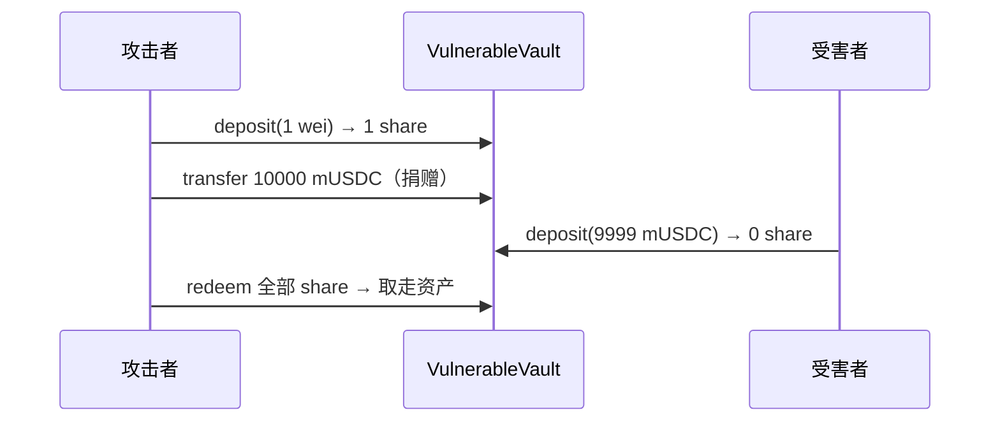

# 经典智能合约漏洞复现实验报告  
## ERC-4626 金库通胀攻击（Inflation Attack）

**姓名**：________　**学号**：________　**日期**：________

---

## 摘要

本实验选取以太坊 DeFi 领域具有代表性的 **ERC-4626 通胀攻击**（又称首存者攻击、捐赠攻击）作为复现对象。项目在本地 Hardhat 环境中实现了一个**故意缺少防护机制**的简化金库合约，并通过链上攻击合约与 Node.js 脚本，完整演示「攻击者首存极少份额 → 捐赠抬高单价 → 受害者存款得 0 份额 → 攻击者赎回获利」的资金盗窃路径。实验不涉及主网部署，仅用于课程教学与漏洞机理理解。

---

## 一、背景介绍

### 1.1 实验任务背景

本实验对应课程要求：**选取一种以太坊历史上的经典智能合约漏洞类型**，使用 Solidity 编写含该漏洞的简易靶场合约，并编写攻击脚本演示资金被盗窃的过程。所选漏洞需具有明确的历史讨论与业界分析，且能在本地链上可重复复现。

### 1.2 以太坊与 DeFi 简要背景

以太坊是一个支持**智能合约**的公有区块链平台。智能合约一旦部署，其逻辑按代码自动执行，链上资产流转难以单方面撤销。DeFi（去中心化金融）将以太坊上的借贷、交易、收益聚合等金融服务合约化，用户通过钱包与合约交互，无需传统金融机构作为中介。

DeFi 协议中常见的**金库（Vault）**模式是：用户存入某种底层资产（如 USDC），获得代表「池内所有权份额」的代币；赎回时按当前份额单价换回资产。2022 年标准化的 **ERC-4626** 为这类金库规定了统一接口，极大提升了协议间的可组合性，但也使一类与**份额换算舍入**相关的漏洞在多个项目中反复出现。

### 1.3 ERC-4626 标准简介

**ERC-4626**（EIP-4626）是以太坊的「代币化金库标准」，核心抽象如下：

| 概念 | 含义 |
|------|------|
| **assets** | 用户存入的底层资产（如 USDC） |
| **shares** | 金库发行的份额代币（ERC-20），代表对池内资产的所有权比例 |
| **deposit** | 存资产，得份额 |
| **redeem** | 烧份额，取资产 |
| **convertToShares / convertToAssets** | 资产与份额的换算函数 |

份额与资产的换算通常形如：

\[
\text{shares} = \left\lfloor \frac{\text{assets} \times \text{totalSupply}}{\text{totalAssets}} \right\rfloor
\]

Solidity 使用整数运算，**向下取整**；当金库处于「份额极少、资产极多」的状态时，正常规模的存款可能被算成 **0 份额**，但资产仍会被合约收走——这正是通胀攻击的数学基础。

### 1.4 通胀攻击的历史与业界关注

通胀攻击在 ERC-4626 标准普及后受到广泛讨论：

- **2022 年**：OpenZeppelin 在 ERC-4626 实现与审计中指出空金库的捐赠风险；GoGoPool（ggAVAX）、Bunni 等项目的审计与公开分析均涉及同类机理。
- **2023 年起**：Trail of Bits、MixBytes、Spearbit 等将「首存者 / 捐赠攻击」列为 4626 金库审计必查项。
- **2025 年 6 月**：ResupplyFi 事件中，攻击者利用 Curve Lend 空 vault 的份额操纵，叠加借贷合约 `exchangeRate` 整数除法归零，造成约 **千万美元级**损失——说明该漏洞在真实 DeFi 组合架构中仍具现实威胁。

与常见的「预言机操纵 + 闪电贷」不同，通胀攻击**不依赖外部价格 feed**，而是利用金库**内部的份额—资产会计关系**与整数舍入，属于**内部分计漏洞**。

### 1.5 本实验选取该漏洞的原因

| 考量 | 说明 |
|------|------|
| **经典性** | 2022 年后 ERC-4626 领域最具代表性的设计类漏洞之一 |
| **可复现性** | 可在 Hardhat 本地链用少量合约与脚本完整演示 |
| **教学价值** | 涵盖整数舍入、ERC-20 转账 vs deposit、信任边界等知识点 |
| **与作业要求匹配** | 有 Solidity 靶场 + 攻击脚本 + 可观测的资金转移 |

---

## 二、项目介绍

### 2.1 项目名称与目标

| 项目 | 内容 |
|------|------|
| **名称** | `erc4626-inflation-lab` |
| **类型** | Hardhat + Solidity 漏洞复现实验 |
| **目标** | 在可控环境中复现 ERC-4626 通胀攻击，理解漏洞根因与防护思路 |
| **范围** | 本地测试链；**禁止**部署至主网或处理真实资产 |

### 2.2 技术栈

| 组件 | 版本 / 说明 |
|------|------------|
| **Solidity** | 0.8.20 |
| **开发框架** | Hardhat 2.x |
| **依赖库** | OpenZeppelin Contracts 5.x（ERC-20、SafeERC20） |
| **测试** | Hardhat + Chai |
| **运行环境** | Node.js 18+；Windows / macOS / Linux |

### 2.3 项目目录结构

```
erc4626-inflation-lab/
├── contracts/
│   ├── MockUSDC.sol           # 实验用 ERC-20 稳定币（18 位小数）
│   ├── VulnerableVault.sol    # 含漏洞的简化 ERC-4626 风格金库
│   └── InflationAttacker.sol  # 链上攻击合约（首存 + 捐赠 + 赎回）
├── scripts/
│   └── attack.js              # 攻击演示脚本（控制台分步输出）
├── test/
│   └── InflationAttack.test.js # 自动化测试（断言受害者 0 份额、攻击者获利）
├── hardhat.config.js          # Hardhat 配置
├── package.json               # 依赖与 npm 脚本
└── README.md                  # 项目说明与运行指南
```

### 2.4 核心模块说明

#### （1）`MockUSDC.sol` — 测试资产

- 实现标准 ERC-20，名称 Mock USDC（`mUSDC`），**18 位小数**（便于演示计算）。
- 提供 `mint` 函数，为实验账户分配测试代币。

#### （2）`VulnerableVault.sol` — 漏洞靶场

简化版 ERC-4626 风格金库，**故意省略**业界已知防护：

- 无虚拟份额 / 虚拟资产（virtual offset）
- 无部署时死份额（dead shares）
- 无 `deposit` 最小份额校验（`minSharesOut`）
- `totalAssets()` 使用 `asset.balanceOf(address(this))`，直接转账（捐赠）会抬高总资产

漏洞核心在 `deposit`：当 `convertToShares(assets)` 为 0 时，仍执行 `safeTransferFrom` 收走资产，但不 mint 份额。

#### （3）`InflationAttacker.sol` — 链上攻击合约

封装三步攻击逻辑：

1. **`setup(seedDeposit, donation)`**：首存极少资产获得份额 → 向金库直接 `transfer` 捐赠
2. 等待受害者存款（脚本 / 测试中由受害者账户调用 `vault.deposit`）
3. **`steal()`**：赎回攻击者持有的全部份额，取走金库内资产

#### （4）`scripts/attack.js` — 攻击演示脚本

在 Hardhat 内置链上部署合约，扮演三个角色：

| 角色 | 行为 |
|------|------|
| **攻击者** | 调用 `InflationAttacker.setup(1 wei, 10000 mUSDC)` |
| **受害者** | 向金库 `deposit(9999 mUSDC)` |
| **攻击者** | 调用 `steal()` 赎回 |

控制台输出各阶段金库份额、资产余额及攻击者获利，便于实验报告截图与记录。

#### （5）`test/InflationAttack.test.js` — 自动化验证

测试用例断言：

- 受害者 `balanceOf` 为 **0**（0 份额）
- 攻击者赎回后 USDC 余额**增加**
- 金库剩余资产接近 **0**

### 2.5 实验参数设计

| 参数 | 取值 | 设计意图 |
|------|------|----------|
| `SEED`（首存） | **1 wei** | 获得极少份额（1 share），操纵成本低 |
| `DONATION`（捐赠） | **10000 mUSDC** | 抬高 `totalAssets`，使单价极高 |
| `VICTIM_DEPOSIT`（受害者存款） | **9999 mUSDC** | 满足 `9999×1/10000` 向下取整为 **0** |

攻击成功后，受害者损失几乎全部存款，攻击者通过赎回收回捐赠成本并掠走受害者资金（扣除首存 1 wei 量级的舍入损失）。

### 2.6 运行方式

在项目根目录执行：

```bash
npm install
npm run compile
npm test
npm run attack
```

| 命令 | 作用 |
|------|------|
| `npm run compile` | 编译 Solidity 合约 |
| `npm test` | 运行 Chai 测试，自动验证攻击成立 |
| `npm run attack` | 运行演示脚本，打印分步控制台输出 |

> **说明**：若项目路径含空格或特殊字符，可能导致 Hardhat 启动异常，建议将项目放在无空格路径下运行，或在报告附录中粘贴本地实际运行截图。

### 2.7 项目与真实 DeFi 的关系

本实验是**教学用的最小化模型**，与链上真实攻击相比：

| 维度 | 本实验 | 真实攻击（如 ResupplyFi 2025） |
|------|--------|------------------------------|
| 执行环境 | Hardhat 顺序脚本 | MEV 抢跑、Flash Loan、单笔原子交易 |
| 攻击目标 | 下一笔 `deposit` 用户 | 可扩展为借贷 LTV 绕过等组合漏洞 |
| 通胀手段 | 直接 `transfer` 捐赠 | 还可通过 LP mint、奖励 sync 等路径 |
| 防护 | 均未实现（故意） | 成熟项目采用 virtual offset、dead shares 等 |

本仓库聚焦**第一层核心机理**；真实案例的扩展分析可作为报告「相关工作」或「延伸讨论」章节。

### 2.8 安全声明

- 合约与脚本**仅用于课程实验与本地安全研究**。
- 不得将以 `VulnerableVault` 为代表的未防护实现部署至主网或测试网公开环境。
- 不得用于对未授权系统的任何攻击行为。

---

## 三、漏洞原理（简述）

攻击分四步：

1. **首存**：攻击者存入 1 wei，获得 1 share（空池或极低 supply 时）。
2. **捐赠**：攻击者向金库地址直接 `transfer` 大量 mUSDC，不 mint 份额 → `totalAssets` 暴增，`totalSupply` 不变。
3. **受害者存款**：`shares = floor(9999 × 1 / 10000) = 0`；资产转入金库，但受害者得 **0 份额**。
4. **赎回**：攻击者持有唯一有效份额，`redeem` 取走池内几乎全部资产。

关键代码（`VulnerableVault.sol`）：

```solidity
function convertToShares(uint256 assets) public view returns (uint256) {
    uint256 supply = totalSupply();
    uint256 assets_ = totalAssets();
    if (supply == 0 || assets_ == 0) {
        return assets;
    }
    return (assets * supply) / assets_;  // 向下取整
}

function deposit(uint256 assets, address receiver) external returns (uint256 shares) {
    shares = convertToShares(assets);
    asset.safeTransferFrom(msg.sender, address(this), assets);  // 先收钱
    if (shares > 0) {
        _mint(receiver, shares);  // 0 份则不 mint —— 漏洞核心
    }
}
```

---

## 四、攻击步骤与运行结果

### 4.1 攻击流程



### 4.2 预期运行结果

运行 `npm run attack` 后，控制台应显示类似信息：

- 金库份额总量：1（setup 后）
- 金库总资产：约 10000 mUSDC
- 受害者获得份额：**0**
- 攻击者赎回后 USDC 余额**显著增加**
- 金库剩余资产接近 0

（请在本机运行后粘贴**实际控制台输出或截图**至此处。）

---

## 五、防护建议

| 措施 | 说明 |
|------|------|
| **虚拟份额 / 虚拟资产** | OpenZeppelin ERC4626 的 `_decimalsOffset()`，使捐赠攻击在经济上不可行 |
| **死份额（dead shares）** | 部署时 mint 一定份额至 `address(0)` 并永久锁定，类似 Uniswap V2 |
| **最低份额校验** | `deposit` / `mint` 要求 `shares >= minSharesOut`，否则 revert |
| **内部记账 totalAssets** | 不单纯依赖 `balanceOf`，减少直接转账的影响（需配合其他措施） |
| **ERC-4626 Router** | 前端 / 聚合器通过 router 强制滑点保护 |

---

## 六、小结

本实验在 Hardhat 本地链上完成了 ERC-4626 通胀攻击的完整复现：通过故意缺失防护的 `VulnerableVault`，清晰展示了**份额换算舍入**与**捐赠操纵 totalAssets**如何叠加，导致后续存款用户「资金被收走却无任何份额凭证」。实验帮助理解 DeFi 金库的信任边界——**资产进入合约并不等价于获得可追溯的所有权份额**；若换算结果为 0 仍执行收款，即构成可被利用的安全缺陷。

---

## 参考文献

1. EIP-4626: Tokenized Vault Standard. https://eips.ethereum.org/EIPS/eip-4626  
2. OpenZeppelin. ERC-4626 Documentation (Inflation Attack). https://docs.openzeppelin.com/contracts/5.x/erc4626  
3. OpenZeppelin. A Novel Defense Against ERC4626 Inflation Attacks. https://www.openzeppelin.com/news/a-novel-defense-against-erc4626-inflation-attacks  
4. MixBytes. Overview of the Inflation Attack. https://mixbytes.io/blog/overview-of-the-inflation-attack  
5. Resupply. crvUSD-wstUSR Market Post Mortem (2025-06-28). https://paragraph.com/@resupply/resupply-crvusd-wstusr-market-post-mortem  

---

*报告完*
